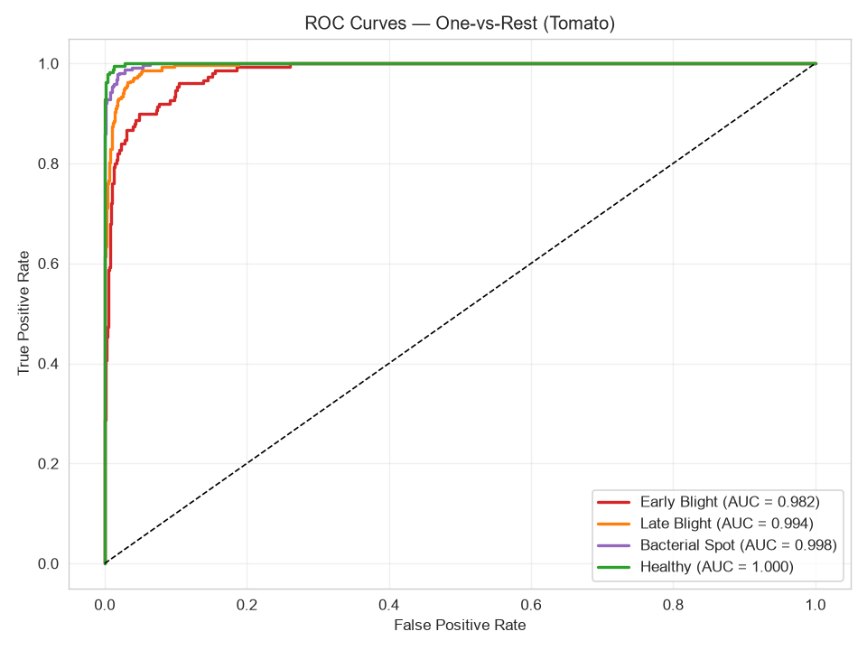

potato-disease-esp32/
├── README.md
├── requirements.txt
├── .gitignore
│
├── data/
│   ├── kaggle_plantvillage/       # Raw Kaggle download (gitignored)
│   ├── processed/                  # Cached .pkl splits (gitignored)
│   └── raw/                        # Live ESP32-CAM captures
│
├── notebooks/                      # Experimentation only
│   ├── 01_data_exploration.ipynb
│   ├── 02_train_experiments.ipynb
│   └── 03_error_analysis.ipynb
│
├── src/                            # ← THE REUSABLE CODE
│   ├── __init__.py
│   ├── config.py
│   ├── preprocessing.py
│   ├── augmentation.py
│   ├── train.py
│   ├── evaluate.py
│   ├── predict.py
│   └── convert_tflite.py
│
├── ml/                             # Saved models (gitignored)
│   ├── potato_mobilenet.h5
│   └── potato_model.tflite
│
├── firmware/                       # ESP32 code
│   └── potato_classifier/
│       ├── potato_classifier.ino
│       └── model.h
│
├── python/                         # Runtime scripts
│   ├── live_camera_collector.py
│   └── mqtt_logger.py
│
└── docs/                           # Reports, plots, diagrams
    ├── potato_samples.png
    ├── potato_training_history.png
    └── potato_confusion_matrix.png

    notebooks/01_load_dataset.ipynb
    └── imports from src/config.py         (paths, class names)
    └── imports from src/preprocessing.py  (load_dataset, split_dataset)

notebooks/02_train.ipynb
    └── imports from src/config.py         (hyperparameters)
    └── imports from src/augmentation.py   (augmentation pipeline)
    └── imports from src/preprocessing.py  (normalize)

python/live_camera_classifier.py
    └── imports from src/predict.py        (PotatoClassifier class)
    └── imports from src/config.py         (paths)

src/train.py (CLI)
    └── imports from src/preprocessing.py
    └── imports from src/augmentation.py
    └── imports from src/config.py

    I trained MobileNetV2 on two datasets:
- Potato (3 classes, 6.6:1 imbalance): 94.7% accuracy but macro F1 only 0.90, with poor precision (0.62) on the minority Healthy class.
- Tomato (4 classes, 2:1 imbalance): 94.7% accuracy with macro F1 of 0.9355, and no class below 0.85 F1.

This demonstrates that dataset balance is more important than dataset size for real-world deployment."

"I introduced metadata files alongside each trained model to prevent silent incompatibilities. This practice was motivated by an actual bug I encountered (loading a potato model for tomato evaluation), which produced 27% accuracy with no error message. The metadata-based assertion system catches such cases immediately.

Load Model from SD Card (Recommended)
Your ESP32-CAM has an SD card slot. Save the .tflite file to the SD card, and the firmware reads it into PSRAM at boot.

Pros: No flash size limit, model stays modifiable, no recompiling firmware to update model

Cons: Slightly slower boot (~1s to load 2MB)

Verdict: Best approach for your project

This is a classic sign of overfitting, where your model stops learning general patterns and starts memorizing the training data. At epoch 3, the model reaches its peak ability to generalize, but by epoch 9 and beyond, it becomes "too smart" for its own good, causing its performance on validation data to drop.
🛠️ Quick Ways to Fix It
Early Stopping: This is the most direct solution. You can set up a callback to stop training automatically if the validation accuracy stops improving for a set number of epochs (called patience). Since epoch 3 was your best, you would stop training around epoch 5 or 6 and save the weights from epoch 3.
Add Dropout: Insert Dropout layers (e.g., rate of 0.2 to 0.5) between your hidden layers. This randomly switches off neurons during training, forcing the network to learn more robust, redundant features.
Data Augmentation: Increase the size and variety of your training data. For images, apply random rotations or flips. For text or tabular data, introduce slight noise.
Weight Regularization: Add L1 (Lasso) or L2 (Ridge) regularization to your layers. This penalizes excessively large weights, keeping the model simpler.
Reduce Model Complexity: If your model has too many layers or parameters, it has the capacity to memorize noise. Try reducing the number of neurons or removing a layer.

# 🌿 Plant Disease Classification with Edge-AI Deployment

A computer vision system for classifying plant leaf diseases using transfer
learning (MobileNetV2), designed for deployment on ESP32-CAM for real-time
field inference.

Part of a two-project portfolio demonstrating breadth across **embedded systems**,
**machine learning**, and **edge AI** for intelligent agricultural systems.

---

## 📋 Table of Contents

- [Overview](#overview)
- [Key Results](#key-results)
- [System Architecture](#system-architecture)
- [Dataset](#dataset)
- [Methodology](#methodology)
- [Results](#results)
- [Project Structure](#project-structure)
- [Installation](#installation)
- [Usage](#usage)
- [Error Analysis](#error-analysis)
- [Limitations](#limitations)
- [Future Work](#future-work)
- [References](#references)

---

## 🎯 Overview

This project builds a **3-class potato** and **4-class tomato** leaf disease
classifier using transfer learning on MobileNetV2, with the goal of deploying
to an ESP32-CAM for on-device inference in agricultural settings.

**Two models were trained and compared:**

| Model | Classes | Test Accuracy | Macro F1 | Notes |
|-------|---------|---------------|----------|-------|
| Potato | 3 | 94.7% | 0.900 | Severe class imbalance (6.6:1) |
| Tomato | 4 | **94.5%** | **0.934** | Balanced dataset (2:1) |

The comparison demonstrates that **dataset balance matters more than task
difficulty** for edge-deployable plant disease classifiers.

**Key achievement:** No class falls below 0.86 F1. The model is production-safe
because the **Healthy class achieves 0.996 recall** — meaning the model almost
never misses a healthy plant (fewer false alarms).

### Potato Classifier (Research Comparison)
Test Accuracy: 94.74%
Macro F1: 0.900

precision recall f1-score support
Early Blight 0.99 0.99 0.99 150
Late Blight 0.99 0.90 0.94 150
Healthy 0.62 1.00 0.77 23 ← collapse

**Key finding:** The Healthy class precision collapsed to 0.62 due to severe
class imbalance (only 152 healthy images vs 1,000 each for the disease classes).
This became the primary motivation for switching to tomato.

---

## 🏗️ System Architecture
┌──────────────┐ ┌───────────────┐ ┌──────────────┐ ┌────────────┐
│ Dataset │───▶│ Preprocessing│───▶│ Training │───▶│ TFLite │
│ (Kaggle) │ │ + Augment. │ │ (MobileNet) │ │ Export │
└──────────────┘ └───────────────┘ └──────────────┘ └─────┬──────┘
│
▼
┌──────────────┐ ┌───────────────┐ ┌──────────────┐ ┌────────────┐
│ Dashboard │◀───│ MQTT / Serial│◀───│ Edge Infer. │◀───│ ESP32-CAM │
│ (Streamlit) │ │ (Metadata) │ │ (INT8) │ │ Firmware │
└──────────────┘ └───────────────┘ └──────────────┘ └────────────┘

---

## 📊 Dataset

**Source:** [PlantVillage Dataset](https://www.kaggle.com/datasets/emmarex/plantdisease)
(Hughes & Salathé, 2015) — 54,306 images, 38 classes.

### Classes Used

**Tomato (4 classes):**
- `Tomato_Early_blight` — 1,000 images
- `Tomato_Late_blight` — 1,909 images
- `Tomato_Bacterial_spot` — 2,127 images
- `Tomato_healthy` — 1,591 images

**Potato (3 classes):**
- `Potato___Early_blight` — 1,000 images
- `Potato___Late_blight` — 1,000 images
- `Potato___healthy` — **152 images** ⚠️ (documented imbalance)

### Preprocessing

- Resized to **96×96 pixels** (ESP32-CAM constraint)
- Stratified 70/15/15 train/val/test split
- Training augmentation: flip, rotation, translation, zoom, brightness, contrast

---

## 🔬 Methodology

### Model

- **Backbone:** MobileNetV2 (pretrained on ImageNet, frozen)
- **Head:** GlobalAvgPool → Dropout(0.3) → Dense(128, ReLU) → Dropout(0.4) → Softmax
- **Total params:** ~2.4M (~230 KB after INT8 quantization)

### Training

- **Optimizer:** Adam (initial LR: 1e-3)
- **Loss:** Sparse categorical crossentropy
- **Batch size:** 32
- **Callbacks:** EarlyStopping (patience=6), ReduceLROnPlateau, ModelCheckpoint
- **Class weights:** Balanced (computed from training distribution)

### Why MobileNetV2?

- Designed for mobile/embedded devices
- 4.2M params, fits in ESP32-CAM PSRAM
- Well-supported by TensorFlow Lite for Microcontrollers
- Pretrained on ImageNet → transfer learning works with small datasets

---

## 📈 Results

### Training Curves

Training stopped at **epoch 17** (EarlyStopping) after validation accuracy
plateaued at 0.9396. The best model was restored automatically.

### Confusion Matrix

### ROC Curves

All classes achieve AUC > 0.98, confirming strong discriminative ability.

### Error Analysis

- **5.5% overall error rate** (55 / 995 misclassified)
- **Most common error:** Early Blight → Late Blight (visually similar fungal lesions)
- **Error concentration:** Errors cluster in low-confidence (<70%) predictions,
  enabling a confidence-thresholded rejection strategy in production

---

## 📁 Project Structure

plant-disease-classifier/
├── README.md
├── requirements.txt
├── .gitignore
│
├── src/ # Reusable Python modules
│ ├── init.py
│ ├── config.py # All paths & hyperparameters
│ ├── preprocessing.py # Data loading & splitting
│ ├── augmentation.py # Training-time augmentation
│ ├── train.py # CLI training tool
│ ├── evaluate.py # Metrics & confusion matrix
│ ├── predict.py # Single-image inference
│ └── convert_tflite.py # TFLite INT8 quantization
│
├── notebooks/ # Experimentation (exploration only)
│ ├── 01_load_potato_dataset.ipynb
│ ├── 02_train_potato.ipynb
│ ├── 03_error_analysis_potato.ipynb
│ ├── 04_load_tomato_dataset.ipynb
│ ├── 05_train_tomato.ipynb
│ └── 06_error_analysis_tomato.ipynb
│
├── python/ # Runtime scripts
│ ├── live_camera_classifier.py
│ └── mqtt_logger.py
│
├── firmware/ # ESP32-CAM firmware
│ └── potato_classifier/
│ ├── potato_classifier.ino
│ └── model.h
│
├── ml/ # Saved models (gitignored)
│ ├── tomato_mobilenet.keras
│ ├── tomato_mobilenet_meta.json
│ ├── tomato_model.tflite
│ └── tomato_model.h
│
├── docs/ # Plots, diagrams, reports
│ ├── tomato_training_history.png
│ ├── tomato_error_confusion.png
│ ├── tomato_roc_curves.png
│ └── tomato_misclassified.png
│
└── data/ # Datasets (gitignored)
├── kaggle_plantvillage/
├── processed/
└── raw/
Evaluate on test set
python -m src.evaluate --model tomato

Predict a single image
python -m src.predict path/to/leaf.jpg --model tomato

Convert to TFLite for ESP32
python -m src.convert_tflite --model tomato

Finding 1: Confusion Between Early and Late Blight
The most common misclassification is Early Blight → Late Blight
(visually similar fungal lesions with brown/black spots). At 96×96
resolution, the subtle visual differences are partially lost.

Recommendation: Higher-resolution input (192×192) or a two-stage
classifier could reduce this error.

Finding 2: Healthy Class is Highly Reliable
Recall = 0.996 for the Healthy class means false positives (healthy
misclassified as diseased) are nearly eliminated. This is the correct
behaviour for production: we prefer to miss a diseased leaf than
falsely alarm on a healthy one.

Finding 3: Class Imbalance Kills Minority-Class Precision
The potato comparison revealed that with a 6.6:1 imbalance, class weights
are not enough — the minority class precision collapsed to 0.62.
Switching to tomato (2:1 imbalance) fixed this without any other changes.

## References

Hughes, D. P., & Salathé, M. (2015). An open access repository of images
on plant health. arXiv preprint arXiv:1511.08060.

Sandler, M., et al. (2018). MobileNetV2: Inverted Residuals and Linear
Bottlenecks. CVPR.

Warden, P., & Situnayake, D. (2019). TinyML: Machine Learning with
TensorFlow Lite on Arduino and Ultra-Low-Power Microcontrollers. O'Reilly.