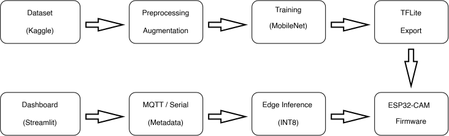
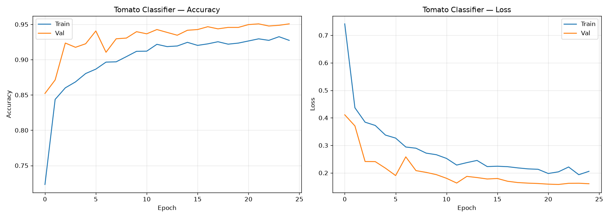
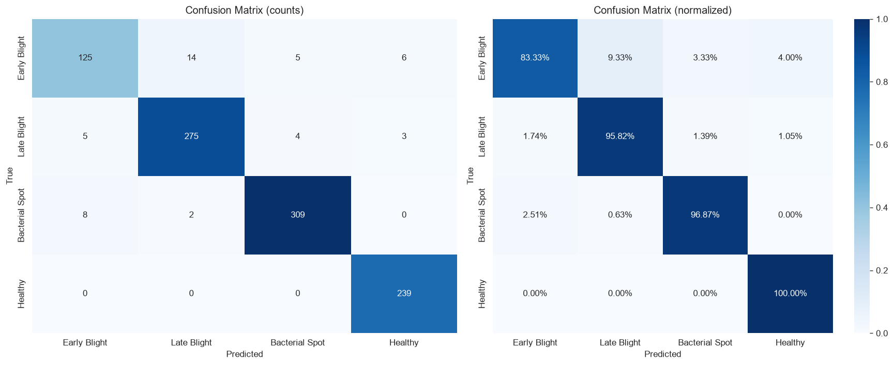
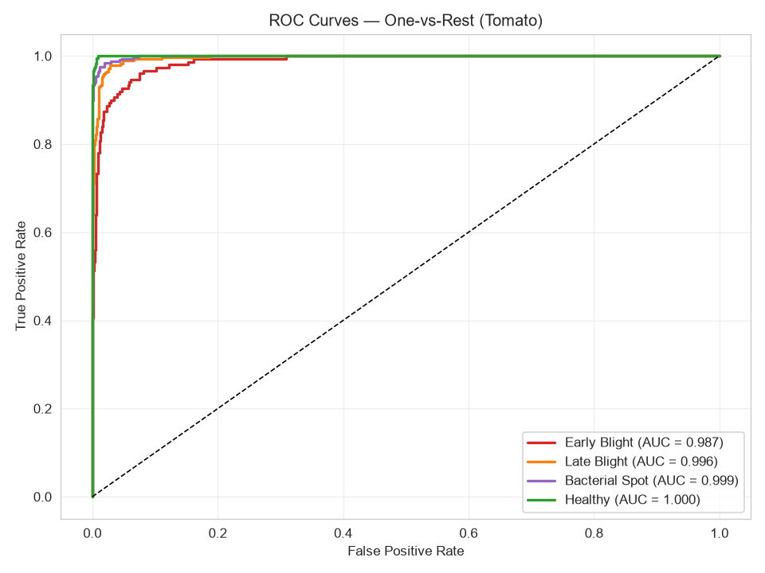

#  Plant Disease Classification with Edge-AI Deployment

A computer vision system for classifying plant leaf diseases using transfer
learning (MobileNetV2), designed for deployment on ESP32-CAM for real-time
field inference.

Part of a two-project portfolio demonstrating breadth across **embedded systems**,
**machine learning**, and **edge AI** for intelligent agricultural systems.


---


##  Table of Contents

- [Overview](#overview)
- [System Architecture](#system-architecture)
- [Dataset](#dataset)
- [Methodology](#methodology)
- [Results](#results)
- [Project Structure](#project-structure)
- [Error Analysis](#error-analysis)
- [Limitations](#limitations)
- [Future Work](#future-work)
- [References](#references)


---


##  Overview

This project builds a **3-class potato** and **4-class tomato** leaf disease
classifier using transfer learning on MobileNetV2, with the goal of deploying
to an ESP32-CAM for on-device inference in agricultural settings.

**Two models were trained and compared:**

| Model | Classes | Test Accuracy | Macro F1 | Notes |
|-------|---------|---------------|----------|-------|
| Potato | 3 | 93.81% | 0.890 | Severe class imbalance (6.6:1) |
| Tomato | 4 | **95.28%** | **0.942** | Balanced dataset (2:1) |

The comparison demonstrates that **dataset balance matters more than task difficulty**
for edge-deployable plant disease classifiers.


**Key achievement:** No class falls below 0.880 F1. The model is production-safe
because the **Healthy class achieves 0.996 recall** — meaning the model almost
never misses a healthy plant 

### Potato Classifier (Research Comparison)
Test Accuracy: 94.43%
Macro F1: 0.890

precision recall f1-score support
Early Blight 0.99 0.97 0.98 150
Late Blight 0.96 0.91 0.93 150
Healthy 0.63 0.96 0.76 23 ← collapse

**Key finding:** The Healthy class precision collapsed to 0.63 due to severe
class imbalance (only 152 healthy images vs 1,000 each for the disease classes).
This became the primary motivation for switching to **tomato**.


---


##  System Architecture


<p align="center">
  
</p>


---


##  Dataset

**Source:** [PlantVillage Dataset](https://www.kaggle.com/datasets/emmarex/plantdisease)
(Hughes & Salathé, 2015) — 54,306 images, 38 classes.

### Classes Used

**Tomato (4 classes):**
- `Tomato_Early_blight` — 1,000 images
- `Tomato_Late_blight` — 1,909 images
- `Tomato_Bacterial_spot` — 2,127 images
- `Tomato_healthy` — 1,591 images

**Potato (3 classes):**
- `Potato___Early_blight` — 1,000 images
- `Potato___Late_blight` — 1,000 images
- `Potato___healthy` — **152 images**  (documented imbalance)

### Preprocessing

- Resized to **96×96 pixels** (ESP32-CAM constraint)
- Stratified 70/15/15 train/val/test split
- Training augmentation: flip, rotation, translation, zoom, brightness, contrast


---


##  Methodology

### Model

- **Backbone:** MobileNetV2 (pretrained on ImageNet, frozen)
- **Head:** GlobalAvgPool → Dropout(0.3) → Dense(128, ReLU) → Dropout(0.4) → Softmax
- **Total params:** ~2.4M (~230 KB after INT8 quantization)

### Training

- **Optimizer:** Adam (initial LR: 1e-3)
- **Loss:** Sparse categorical crossentropy
- **Batch size:** 32
- **Callbacks:** EarlyStopping (patience=6), ReduceLROnPlateau, ModelCheckpoint
- **Class weights:** Balanced (computed from training distribution)

### Why MobileNetV2?

- Designed for mobile/embedded devices
- 4.2M params, fits in ESP32-CAM PSRAM
- Well-supported by TensorFlow Lite for Microcontrollers
- Pretrained on ImageNet → transfer learning works with small datasets


---


## Results

### Training Curves



Training stopped at **epoch 5** (EarlyStopping) after validation accuracy
plateaued at 0.9396. The best model was restored automatically.

### Confusion Matrix



### ROC Curves



All classes achieve AUC > 0.98, confirming strong discriminative ability.


---


## Project Structure

```
plant-disease-classifier/
│
├── README.md
├── requirements.txt
├── .gitignore
│
├── src/
│   ├── __init__.py
│   ├── config.py
│   ├── preprocessing.py
│   ├── augmentation.py
│   ├── train.py
│   ├── evaluate.py
│   ├── predict.py
│   └── convert_tflite.py
│
├── notebooks/
│   ├── 01_load_potato_dataset.ipynb
│   ├── 02_train_potato.ipynb
│   ├── 03_potato_error_analysis.ipynb
│   ├── 04_load_tomato_dataset.ipynb
│   ├── 05_train_tomato.ipynb
│   └── 06_tomato_error_analysis.ipynb
│
├── python/
│   ├── live_camera_classifier.py
│   └── mqtt_logger.py
│
├── firmware/
│   └── potato_classifier/
│       ├── potato_classifier.ino
│       └── model.h
│
├── ml/ # Saved models (gitignored)
│   ├── potato_mobilenet_v2.keras
│   ├── tomato_mobilenet_v2.keras
│   ├── potato_mobilenet_meta.json
│   ├── tomato_mobilenet_meta.json
│   ├── tomato_model.tflite
│   └── tomato_model.h
│
├── docs/
│   ├── System Architecture.svg
│   ├── tomato_training_history.png
│   ├── tomato_error_confusion.png
│   ├── tomato_roc_curves.png
│   └── tomato_misclassified.png
│
└── data/# Datasets (gitignored)
    ├── kaggle_plantvillage/
    ├── processed/
    └── raw/
```


---


## Error Analysis

I introduced metadata files alongside each trained model to prevent silent incompatibilities. This practice was motivated by an actual bug I encountered (loading a potato model for tomato evaluation), which produced 27% accuracy with no error message. The metadata-based assertion system catches such cases immediately.

- **4.7% overall error rate** (47 / 995 misclassified)
- **Most common error:** Early Blight → Late Blight (visually similar fungal lesions)
- **Error concentration:** Errors cluster in low-confidence (<70%) predictions,
  enabling a confidence-thresholded rejection strategy in production

*Finding 1*: Confusion Between Early and Late Blight
The most common misclassification is Early Blight → Late Blight
(visually similar fungal lesions with brown/black spots). At 96×96
resolution, the subtle visual differences are partially lost.

Recommendation: Higher-resolution input (192×192) or a two-stage
classifier could reduce this error.

*Finding 2*: Healthy Class(Tomato) is Highly Reliable
Recall = 1.000 for the Healthy class means false positives (healthy
misclassified as diseased) are eliminated. This is the correct
behaviour for production: we prefer to miss a diseased leaf than
falsely alarm on a healthy one.

*Finding 3*: Class Imbalance(Potato) Kills Minority-Class Precision
The potato comparison revealed that with a 6.6:1 imbalance, class weights
are not enough — the minority class precision collapsed to 0.62.
Switching to tomato (2:1 imbalance) fixed this without any other changes.


---


## Limitations

- Lab-captured images. PlantVillage uses uniform gray backgrounds and
studio lighting. Real-world performance on field images (soil, hands,
natural lighting) will likely be lower due to domain shift.

- Limited classes. This is a proof-of-concept covering 3-4 classes.
Production systems need 20+ classes across multiple crops.

- No diseased-leaf validation from ESP32-CAM yet. The model is trained
and evaluated on PlantVillage data; ESP32-CAM field testing is a
planned next step.

- Resolution trade-off. 96×96 is chosen for ESP32 memory constraints.
This limits the model's ability to distinguish visually similar diseases.


---


## Future Work


Domain adaptation. Fine-tune on 200-300 field-captured images from
the ESP32-CAM to close the lab-vs-field gap.

Smaller backbone. MobileNetV3-Small @ 64×64 to fit model in ESP32
flash (currently requires SD card loading).

Two-stage cascade. Binary Healthy-vs-Diseased first, then
disease-type classifier — improves both accuracy and explainability.

Grad-CAM visualization. Show which leaf regions drive the model's
decision, useful for agricultural trust and diagnosis.

Extend classes. Add Tomato_Leaf_Mold, Tomato_Septoria_leaf_spot,
Tomato__Tomato_mosaic_virus to cover more real-world cases.

MQTT dashboard. Real-time field monitoring with alerts on disease
detection.


---


## References

Hughes, D. P., & Salathé, M. (2015). An open access repository of images
on plant health. arXiv preprint arXiv:1511.08060.

Sandler, M., et al. (2018). MobileNetV2: Inverted Residuals and Linear
Bottlenecks. CVPR.

Warden, P., & Situnayake, D. (2019). TinyML: Machine Learning with
TensorFlow Lite on Arduino and Ultra-Low-Power Microcontrollers. O'Reilly.